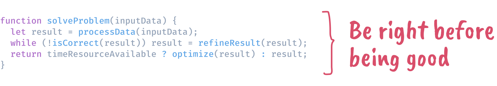

## Hi there 👋, I'm Himanshu

As a seasoned frontend engineer with more than 3 years of hands-on experience in
web development, I've been involved in designing, developing, and deploying
applications across various technologies and programming languages. I have a
passion for crafting seamless, user-centric software applications. Alongside my
strong problem-solving skills and ability to thrive in collaborative team
environments, I am committed to continuous growth and refinement of my coding
skills as a software engineer.

At the end of the day, what really drives me is the chance to work on innovative
projects that make a genuine difference. Let's connect and explore opportunities
to create impactful solutions together!

 

 

### More About Me

- 💼 &nbsp; Software Engineer at [TCS](http://tcs.com/)
- 📈 &nbsp; Passionately building [NovaCraftsAI.com](https://novacraftsai.com)
- 🌱 &nbsp; I’m currently learning about **software architecture**
- 👨🏻‍💻 &nbsp; Most of my projects are available on
  [Github](https://github.com/hj1x?tab=repositories) and on my
  [portfolio](https://www.himanshujaroli.netlify.com/portfolio).
- 💬 &nbsp; [Ask me](https://cal.com/himanshu-jaroli-cjbeah/30min) about anything
  tech or business related, I am happy to help.
- 📫 &nbsp; Feel free to ping me on
  [LinkedIn](https://www.linkedin.com/in/himanshu-jaroli/) or drop a mail at [mail](jaroli.himanshu.work@gmail.com)
- 📝 &nbsp; Checkout my
  [resume](https://www.himanshujaroli.netifly.app/resume.pdf)

 

<!-- Removing for now. Should be refined for a clearer picture of stack/expertise
### Languages and Tools

  
  
  
  
  
  
  
  
  
  
  
  
  
  
  
  
  
  
  
  
  
  
  
  
  
  
  
  
  
  
  

-->
