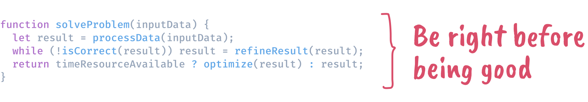

## Hi there 👋, I'm Himanshu

I’m a software engineer with 4+ years of experience who enjoys solving real-world problems through technology by building and shipping end-to-end products.

🚀 Building [**ReferMate**](https://refermate.novacraftsai.com/) and [**NovaCraftsAI**](https://novacraftsai.com/).

<!--

-->

### More About Me

- 🌐 Part of the **[Toptal](https://www.toptal.com/) network**
- 🏦 Built and scaled **production enterprise systems** at [TCS](https://www.tcs.com/)
- 🧠 Focused on **system architecture, scalability, and AI**
- 🛠️ Shipping products and experiments on
  [GitHub](https://github.com/HJ1X?tab=repositories) and my
  [Portfolio](https://himanshujaroli.novacraftsai.com)
- 🌍 Based in India, working with **global teams**
- 📫 Feel free to ping me on
  [LinkedIn](https://www.linkedin.com/in/himanshu-jaroli/)

 

<!-- Removing for now. Should be refined for a clearer picture of stack/expertise
### Languages and Tools

  
  
  
  
  
  
  
  
  
  
  
  
  
  
  
  
  
  
  
  
  
  
  
  
  
  
  
  
  
  
  

-->
